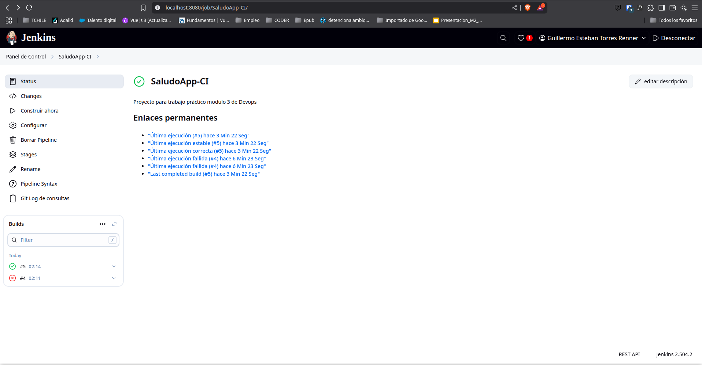

# Equipo 2
## Integrantes:
- Francisco Leiva
- Guillermo Torres

---

### **¿Qué beneficios concretos viste al automatizar la construcción con Jenkins?**
Automatizar la construcción con Jenkins permite detectar errores rápidamente, reduce el trabajo manual, asegura la repetibilidad de los procesos y facilita la integración continua, mejorando la eficiencia y la calidad del software.

---

### **¿Qué parte del proceso crees que sería más crítica en un equipo grande?**
La integración y las pruebas automáticas son críticas, ya que permiten detectar conflictos y errores de manera temprana cuando varios desarrolladores trabajan en paralelo, evitando problemas en etapas avanzadas.

---

### **¿Cómo Jenkins asegura calidad antes de hacer despliegues?**
Jenkins ejecuta pruebas automáticas y validaciones en cada cambio, asegurando que solo el código que pasa todas las pruebas avance en el pipeline. Esto previene la introducción de errores en producción.

---

### **¿Qué cambiarías en este pipeline para prepararlo para producción?**
Implementaría diferentes ramas en el repositorio, como una rama *release* para los cambios destinados a producción. Además, crearía en Jenkins un nuevo Job asociado a esta rama para ejecutar acciones de testing y despliegue automatizado. También agregaría etapas de análisis estático de código, pruebas de integración, despliegue en entornos de staging y manejo seguro de credenciales.

---

### **Presentar brevemente su experiencia: ¿qué aprendieron?, ¿qué les sorprendió más?**
Durante esta experiencia aprendí la importancia de la automatización en los procesos de desarrollo y despliegue. Me sorprendió lo sencillo que puede ser detectar errores de manera temprana y cómo Jenkins facilita la integración continua, permitiendo que el equipo se enfoque más en el desarrollo y menos en tareas repetitivas. Además, descubrí el valor de tener pipelines claros y bien estructurados para mantener la calidad y la estabilidad del software.

---

## Caso de éxito 
